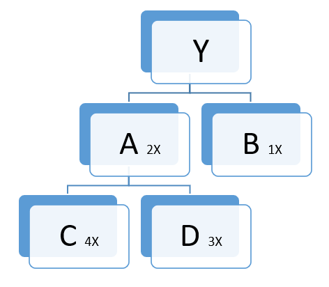
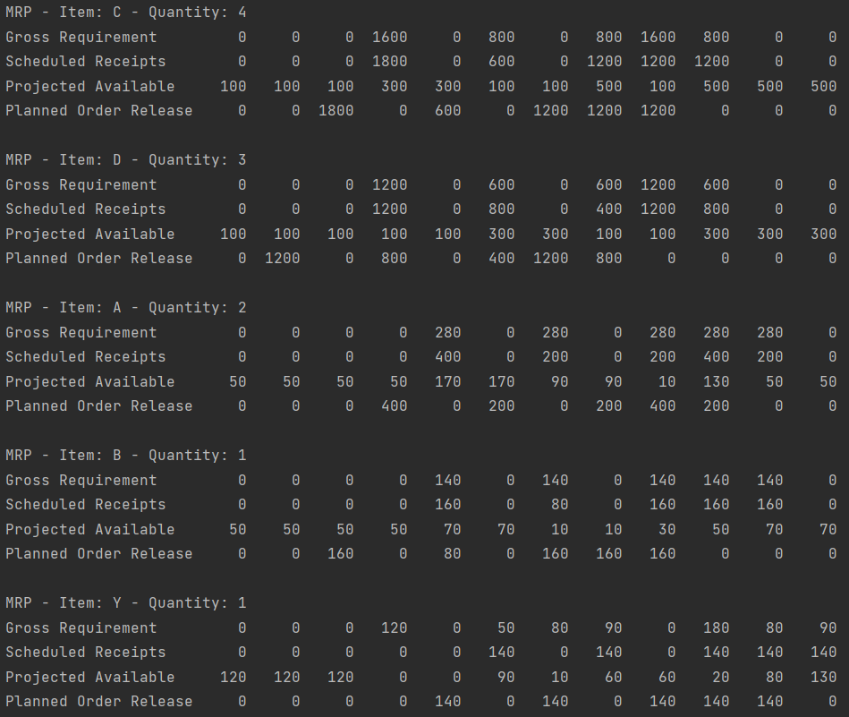

# Production Planning & Control

In order to learn some Java, I will build this PCP application. Right now I'm focusing on the business logic (forecasting, MRP and PERT/CPM), and after that I will make it useful.

The roadmap is divided in three steps: make it work, make it right, and make it fast. I will add or remove goals as I see if they are ok or not, if I can decompose in sub-goals, etc. There are features that are too far way of being implemented, so I put them in a separate section. This README ends with a section showing some preview of the application.

In the meantime, I will try to employ a DevOps pipeline in the project. Right now (and this may change), the tools I will be using in each step are:

- **Plan**: my head.
- **Code**: Java, IntelliJ, Git and GitHub.
- **Build**: Gradle.
- **Test**: JUnit, Mockito, Selenium(maybe?).
- **Release**: GitHub Actions.
- **Deploy**: Docker, (first Heroku, and later AWS).
- **Operate**: Kubernetes.
- **Monitor**: I have no idea.

Since I'm learning while developing this project, some of this can be really wrong, or unnecessary.
<details>
  <summary>Project Goals</summary>
  
## 1. MAKE IT WORK

### FORECASTING

Quantitative methods

✅ Simple moving average

✅ Weighted moving averages

✅ Simple exponential smoothing

✅ Regression

Forecast errors

✅ Mean Forecast Error

✅ Mean Absolute Deviation

✅ Tracking Signal

### MRP (Material Requirement Planning)

✅ Transverse the tree

✅ Calculate the order for all children of a item

✅ Calculate the order for all children of a item, unifying repeated items in a single production order

✅ Add children after the creation of the item, set/update children and delete children

✅ Generate Bill of Materials (BOM)

### PERT/CPM
⬜ PERT/CPM

## 2. MAKE IT RIGHT
⚠️ Add unit tests with JUnit - *In progress*

⚠️ Build the project as a Spring REST API - *In progress*

⬜ Add user login (OAuth maybe?)

⚠️ Integrate with PostgreSQL database - *In progress*

⬜ Develop a web user interface (maybe pure Javascript, maybe React, don't know yet)

⬜ Develop a desktop user interface (maybe Electron, maybe JavaFX, don't know yet)

## 3. MAKE IT FAST (not much, actually)
⬜ Add integration tests

⬜ Add CI/CD (probably GitHub Actions)

⬜ Use docker

⬜ Use kubernetes

⬜ Deploy somewhere (AWS? Heroku?)

⬜ Add some monitoring tools

⬜ Rewrite the entire project in Assembly

## 4. NOT ANYTIME SOON
⬜ Generate PDF reports with tables, graphs, all the pretty stuff

⬜ Send reports to an email list
</details>

<details>
  <summary>Project preview</summary>
  
FORECASTING

You can do linear regression with the Linear Least Squares method, like that:

Create the data.
```
Data x = new Data(1, 2, 3, 4, 5, 6, 7, 8);
Data y = new Data(256, 312, 426, 278, 298, 387, 517, 349);
```

Put the data in the constructor of LinearLeastSquares.
```
LinearLeastSquares lls = new LinearLeastSquares(x, y);
```

Print the results.
```
lls.print();
y = 18.80x + 268.29
```

Given a demand and its forecast, you can calculate some forecast errors.

Initialize the demand and forecast data.
```
Data d = new Data(12, 15, 13, 16, 14, 12);
Data f = new Data(14, 13, 12, 13, 15, 14);
```

Instantiate  a new error, with the datasets.
```
Error e = new Error(d, f);
```

Calculate the Mean Forecast Error, Mean Absolute Deviation and Tracking Signal errors.
```
e.meanForecastError();
e.meanAbsoluteDeviation();
e.trackingSignal();
```

MRP

Given a tree of materials, and the requirements for the root item, you can generate the order production for all chidren.



Here is the constructor of an item, and it's children:
```
public Item(String name, double initialStock, double leadTime, double safetyStock, double lotSize, Child... children);
public Child(Item item, int quantity);
```

You create the items.
```
Item c = new Item("C", 100, 1, 50, 600);
Item d = new Item("D", 100, 2 , 100, 400);
Item b = new Item("B", 50, 2, 0, 80);
Item a = new Item("A", 50,  1, 0, 200, new Child(c, 4), new Child(d, 3));
Item y = new Item("Y", 120, 1, 0, 140, new Child(a, 2), new Child(b, 1));
```

Set the demand for the root item.
```
y.demand(0, 0, 0, 120, 0, 50, 80, 90, 0, 180, 80, 90);
```

Calculate the planned order release. The argument in plan() is the multiple of the item for a given tree. For the root item, it will always be 1. In the case of item A, for this tree, it will be 2, and for C, it will be 4.
```
MRP mrp = y.plan(1);
```

And print the results.
```
mrp.print();
```

</details>
